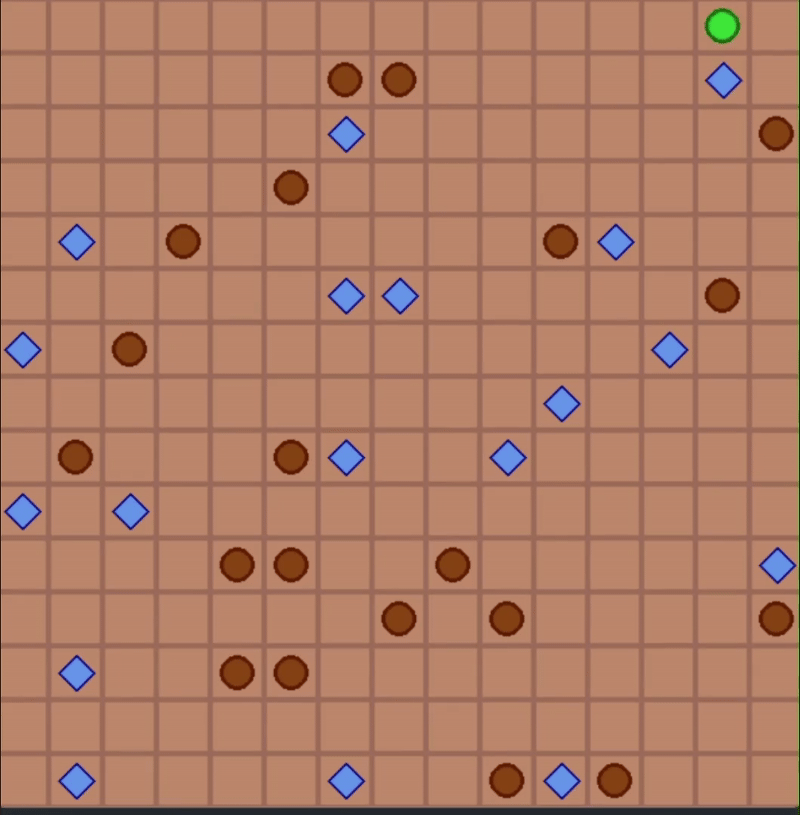

# Mars Exploration Environment

A grid-based environment for autonomous agent exploration with first-order logic constraints. Designed for developing and testing logical agents that navigate hazardous terrain while collecting resources.

## Features

- 🪐 Grid-based Mars terrain simulation
- 🕳️ Hazardous holes with logical constraints
- 📦 Collectible resource packages (goods)
- 🧠 First-order logic state representations
- 🎮 Pygame visualization system
- 🔄 Partially observable environment dynamics

## Installation

1. **Requirements**:
   - Python 3.8+
   - Pygame 2.0+

2. **Install Pygame**:
   ```bash
   pip install pygame
   ```
# Environment Rules & Logic
## Core Axioms

- State Exclusivity (∀ cells):

    ``` ∀c ∈ Grid, ((Hole(c) → ¬Good(c) ∧ ¬Empty(c)) ∧
            (Good(c) → ¬Hole(c) ∧ ¬Empty(c)) ∧
            (Empty(c) → ¬Hole(c) ∧ ¬Good(c)))
    ```
- Movement Constraints:

    This constraint says it is safe to move to an adjacent block known as **d**
    ``` SafeMove(d) ≡ ∃c ∈ Adjacent(d), ¬Hole(c)
    CollectGood(d) ≡ ∃c ∈ Adjacent(d), Good(c)
    ```

- Termination Conditions:
    ``` GameOver ≡ ∃c ∈ Grid, (AtAgent(c) ∧ Hole(c)) ∨
            (∀c ∈ Grid, ¬Good(c))
    ```

- First-Order Logic Implementation
```
#State validation in take_action()
if cell.isHole():
    # ∀a ∈ Actions, EnterHole(a) → Terminate
    self.is_lost = True

elif cell.isGood():
    # ∃g ∈ Goods, Collect(g) → UpdateState(g, Empty)
    cell.set_empty()
```

# Agent Logical Model
This agent is knowledge based thus to model agent via first-order logic (predicate logic) better to say it policy we need to define the language.

A language is defined by :
- Predicate variables 
    - ``` V_ij for i in height and j in width ``` : for every element in the mars grid
- Predicate symboles 
    - ``` A_1 ```: Is there a hole in this block ?
    - ``` A_2 ```: Is there goods in this block ?

After having the language we must define the selection rules that states is the selected block suitable to move to ? in other words is this block satisfies the suitability constraint ?

For all adjacent blocks this suitability formula is evaluated and amoung satisfied adjacent blocks , select unseen one by DFS algorithm as a final action which policy selected it . 

### Suitability rule 
``` 
    A_2(b) ∨ (¬A_1(b) ∧ (∀r ∈ Neighbors(b), ¬A_2(r)))
```


## Performance visualization 

